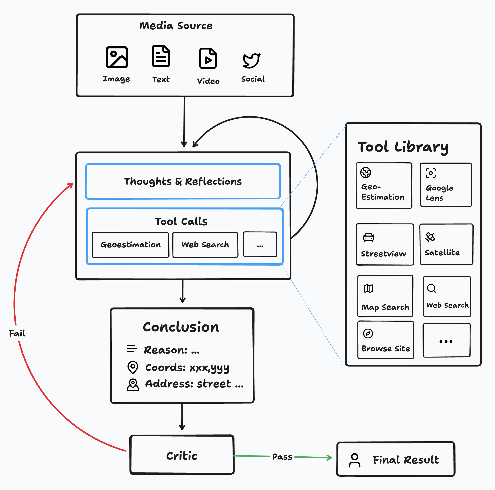
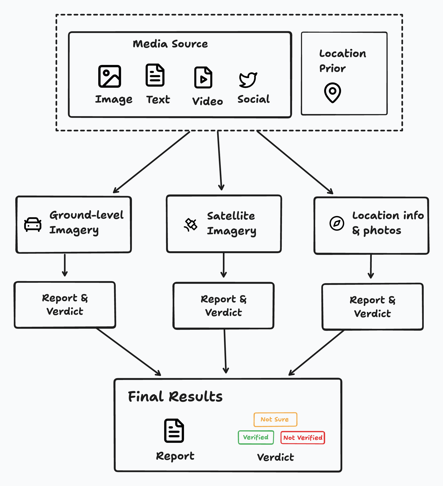

EarthKit Agent accelerates and automates the process of **geolocation** and **geoverification**.

**Geolocation** refers to the process of determining the geographic location of media such as images, videos, and documents. **Geoverification** refers to the process of verifying the accuracy of media and its claimed geolocation.

Here's how EarthKit Agent works for each of these tasks. Additionally, you can browse public geolocation and verification sessions at the [explore page](https://agent.earthkit.app/feed).

## Geolocation

For geolocation, we run a multi-modal agent that takes in a piece of media, and at each step, reasons about the investigative process and executes actions to gather information about the geolocation of the media.
When a conclusion is reached, a critic determines whether the conclusion is confident enough to be used for a geolocation task.
If so, a final result is returned to the user.
Optionally, users can choose to further [verify](#geoverification) the result. 
A diagram of the process is shown below.

## Geoverification

Given a piece of media and a location prior, the geoverification workflow first uses a large multimodal model to match the media against the following information fetched from the location:
- Ground level imagery (street view)
- Satellite imagery
- Location metadata (address, associated photos, etc. )

Finally, the reports and verdicts based on each of these modalities are aggregated to produce a final result.
A diagram of the process is shown below.

